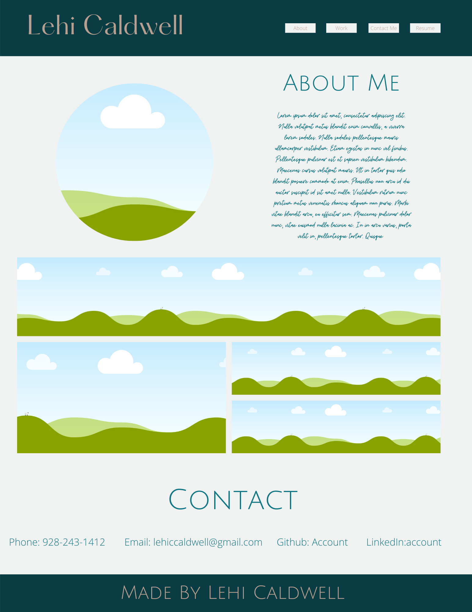

# My Porfolio

This is my personal online portfolio.

## Getting Started

This online porfolio was helped launched by [Github](https://github.com/) also being able to use the Mac terminal to Git push documents from the software "Visual Studio Code 2"
- - - 
### Prerequisites

So of the items I used to make this website up and running
```
1. Github
2. Git bash / terminal
3. Visual Studio Code 
```

### Installing

These are the tools I used and how I used them.

The steps I took was:

```
I created a new repository in my Github account. After which I created the html file and the css file. I opened these files in the Visual Studio Code editor. From there I was able to structure both the files to my liking and then would do a git push command when ever changes where made.
```

I repeated this process finished.


- - - 

## Built With

* [HTML](https://lehicaldwel.github.io/Professional-Portfolio/
* [CSS](style.css)

- - - 

## Deployed Link

* [See Live Site](https://lehicaldwel.github.io/Professional-Portfolio/)

- - - 

## Author

* **Lehi Caldwell** 

- [Link To My Portfolio Site](https://lehicaldwel.github.io/Professional-Portfolio/)
- [Link To My Github](https://github.com/lehicaldwel)
- [Link To My LinkedIn](https://www.linkedin.com/in/lehi-caldwell-932467186/)

- - -
## Acknowledgments

### Resources: ###
* [w3schools](https://www.w3schools.com/tags/tryit.asp?filename=tryhtml_link_target): This resource was used to figure out how to link certain words to another website.
```
<a href="https://www.linkedin.com/in/lehi-caldwell-932467186/" target="_blank" class="nav">LinkedIn</a>
```


* [w3schools navbar css](https://www.w3schools.com/css/css_navbar_horizontal.asp): This resource was used to try to figure out how css works in trying to align the navbar.
```
li {
    display: inline-block;
    padding: 5px;
    margin-left: 100px;
    margin-top: 15px;
}
```

* [index.html](file:///Users/lehicaldwell/Desktop/ucb-virt-fsf-ft-06-2021-u-lol/course-content/01-html-git-css/activities/21-Ins_CSS-positioning/index.html): This is the html that was used to construct the web page and how to potion the css.
```
.flex-container {
    display: flex;
    width: 1080px;
    text-align: center;
    margin: 50px;
```


* [mozilla](https://developer.mozilla.org/en-US/docs/Web/HTML/Inline_elements): This website gave more insight on how to use the inline-elements.
```
img.profile {
    display: inline-flex;
    width: 100%;
}
```


* [Canva](https://www.canva.com/design/DAEhzNipY7o/qd7WEyo7-m6F-RVoJZmJ3g/edit): I used this website to help wire frame my website so I can what I want the end result to look like.


* [css-tricks](https://css-tricks.com/snippets/css/a-guide-to-flexbox/#basics-and-terminology): This resource gave more insight on how to place elements and their alignment on the web-page.
```
.flex-container {
    display: flex;
    width: 1080px;
    text-align: center;
    margin: 50px;
}
```

* [stackoverflow](https://stackoverflow.com/questions/48489057/how-to-move-the-div-element-to-the-right-side-of-the-page): I used this resource to try to understand how to move elements on the right side of the page.
```

.image5 {
    position: absolute;
    right: 405px;
    top: 150px;
}
```


* [w3](https://www.w3.org/Style/Examples/007/center.en.html): This URL taught how to center elements on the page.
```
ul.list{
    text-align: center;
    border-style: groove;
}

```

* [w3docs](https://www.w3docs.com/snippets/html/how-to-create-an-anchor-link-to-jump-to-a-specific-part-of-a-page.html): In this resource I was able to learn how to make links within the same web-page.

```
<li><a href="#about-me" class="nav">About Me</a></li>
```